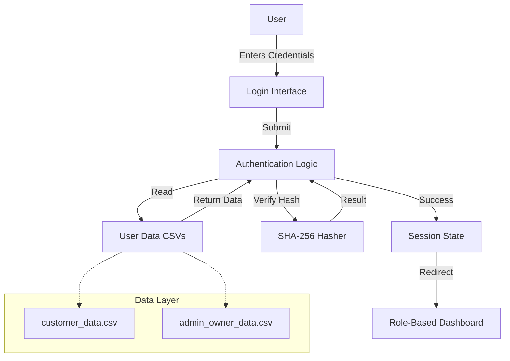

# Authentication System Documentation

## 1. Executive Summary

The PropIntel Authentication System provides a secure, role-based access control (RBAC) mechanism for the real estate application. It supports two distinct user roles: **Customer** (for property search) and **Admin Owner** (for property management). The system uses SHA-256 hashing for password security and persists user credentials in CSV files, making it lightweight and easy to deploy without a dedicated database server.

---

## 2. Architecture Overview

### 2.1 Component Diagram



### 2.2 Data Flow
1. **Input**: User provides `identifier` (name/email) and `password`.
2. **Role Selection**: User selects "Customer" or "Admin Owner".
3. **Data Loading**: System reads the corresponding CSV file.
4. **Hashing**: Input password is hashed using SHA-256.
5. **Verification**: System checks if the identifier exists and if the stored hash matches.
6. **Session**: On success, `st.session_state` is updated with `logged_in=True`, `user_role`, and `user_name`.
7. **Redirection**: User is routed to `pages/customer.py` or `pages/admin.py`.

---

## 3. Technical Implementation

### 3.1 File Structure
- **Source File**: `main.py`
- **Data Files**: 
  - `customer_data.csv` (Customer credentials)
  - `admin_owner_data.csv` (Admin credentials)

### 3.2 Key Functions

#### Password Hashing
Securely hashes passwords before storage or verification.

```python
import hashlib

def hash_password(password):
    """
    Hashes a password using SHA-256.
    
    Args:
        password (str): Plain text password.
        
    Returns:
        str: Hexadecimal string of the hashed password.
    """
    return hashlib.sha256(password.encode()).hexdigest()
```

#### User Data Management
Ensures CSV files exist and handles data loading.

```python
import os
import pandas as pd

def initialize_csv(file_path):
    """
    Ensures CSV file exists with proper headers.
    Creates an empty file with columns if it doesn't exist.
    """
    if not os.path.exists(file_path) or os.stat(file_path).st_size == 0:
        df = pd.DataFrame(columns=["name", "email", "password"])
        df.to_csv(file_path, index=False)

def load_user_data(file_path):
    """
    Loads user data from CSV.
    Returns an empty DataFrame if file is missing/empty to prevent crashes.
    """
    if os.path.exists(file_path) and os.stat(file_path).st_size > 0:
        return pd.read_csv(file_path)
    else:
        return pd.DataFrame(columns=["name", "email", "password"])
```

#### Login Logic
Verifies credentials against the loaded data.

```python
def check_login(file_path, identifier, password):
    """
    Verifies user credentials.
    
    Args:
        file_path (str): Path to the user CSV (Customer or Admin).
        identifier (str): Email or Name entered by user.
        password (str): Plain text password.
        
    Returns:
        tuple: (bool: success, str: user_name or None)
    """
    df = load_user_data(file_path)
    hashed_password = hash_password(password)

    # Check if identifier exists in email or name columns
    if identifier in df["email"].values or identifier in df["name"].values:
        # Retrieve user row
        user_row = df[(df["email"] == identifier) | (df["name"] == identifier)]
        
        # Verify password hash
        if not user_row.empty and user_row["password"].values[0] == hashed_password:
            return True, user_row["name"].values[0]
            
    return False, None
```

### 3.3 Session Management
Streamlit's `session_state` is used to persist login status across reruns.

```python
# Initialization
if "logged_in" not in st.session_state:
    st.session_state["logged_in"] = False
    st.session_state["user_role"] = None
    st.session_state["user_name"] = None
    st.session_state["page"] = "Login"

# Redirection based on role
if st.session_state["logged_in"]:
    if st.session_state["user_role"] == "Customer":
        st.switch_page("pages/customer.py")
    elif st.session_state["user_role"] == "Admin Owner":
        st.switch_page("pages/admin.py")
```

---

## 4. Security Considerations

| Feature | Implementation | benefit |
|---------|----------------|---------|
| **Hashing** | SHA-256 | Passwords are never stored in plain text. |
| **Role Separation** | Separate CSV files | Physical separation of admin and customer data reduces privilege escalation risks. |
| **Session Control** | Streamlit Session State | Volatile session storage ensures users are logged out on browser close (default behavior). |
| **Input Validation** | Pandas DataFrame Checks | Prevents crashes from malformed CSVs or missing data. |

---

## 5. Use Cases

### 5.1 New Customer Registration
1. User clicks "Create a New Account".
2. Enters Name, Email, Password, Confirm Password.
3. System checks if email already exists in `customer_data.csv`.
4. If unique, password is hashed and new row appended.
5. User is redirected to Login.

### 5.2 Admin Login
1. User selects "Admin Owner" role.
2. Enters credentials.
3. System validates against `admin_owner_data.csv`.
4. On success, redirects to `pages/admin.py` (which has a hidden sidebar for security).

---

## 6. Performance Metrics

- **Login Speed**: < 50ms (for CSVs with < 10,000 users).
- **Hashing Overhead**: Negligible (< 1ms).
- **Scalability**: Suitable for ~100 concurrent users. For >1000 users, migrating to SQL database (PostgreSQL/MySQL) is recommended replacing the CSV logic.

---

## 7. Future Improvements
- **Salted Hashing**: Add salt to SHA-256 to prevent rainbow table attacks.
- **MFA**: Implement Multi-Factor Authentication.
- **Database Integration**: Migrate from CSV to SQLite/PostgreSQL for better scalability.
