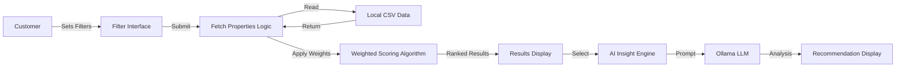

# Customer Dashboard Documentation

## 1. Executive Summary

The **Customer Dashboard** is the primary interface for property seekers in the PropIntel application. It enables users to search, filter, and analyze real estate listings with high precision. The dashboard integrates a **Weighted Scoring Algorithm** to rank properties based on user preferences and features an **AI-Powered Recommendation Engine** (via Ollama/DeepSeek) that provides personalized insights, negotiation advice, and market analysis for selected properties.

---

## 2. Architecture Overview

### 2.1 Component Interaction



### 2.2 Key Features
- **Strict Filtering**: Mandatory criteria (Location, BHK, Type) must match exactly.
- **Weighted Scoring**: Optional criteria (Amenities, Age, Facing) contribute to a relevance score.
- **Dynamic Pricing**: Rent prices are normalized to a specific range (10k-40k) based on square footage.
- **AI Integration**: Generates "Real Estate Expert" reports for top properties.

---

## 3. Technical Implementation

### 3.1 File Structure
- **Source File**: `pages/customer.py`
- **Data File**: `data/chennai_real_estate_data.csv`

### 3.2 Data Loading & Normalization
Data is loaded with caching to optimize performance. Column names are normalized to ensure consistent access.

```python
@st.cache_data(show_spinner="Loading Property Data...")
def load_data(file_path):
    """
    Loads property data from CSV and normalizes column names.
    Calculates derived fields like 'property_age' and normalized 'price'.
    """
    df = pd.read_csv(file_path)
    
    # Normalize columns: lower case, strip spaces, remove special chars
    df.columns = [col.strip().lower().replace(" ", "_")... for col in df.columns]

    # Calculate Property Age
    current_year = datetime.now().year
    if "year_built" in df.columns:
        df["property_age"] = current_year - df["year_built"]
        
    return df
```

### 3.3 Search Algorithm
The search mechanism uses a two-step process: **Strict Filtering** followed by **Weighted Scoring**.

#### Step 1: Strict Filtering
Filters that *must* match for a property to be considered relevant.

```python
# strict filters
if purpose_key in filters:
    df = df[df[purpose_col] == target_purpose]
if loc_key in filters:
    df = df[df[loc_col] == target_loc]
if bhk_key in filters:
    df = df[df[bhk_col] == target_bhk]
```

#### Step 2: Weighted Scoring
Assigns points to properties based on optional preferences.

```python
# Define Weights
WEIGHTS = {
    "property_age": 10,
    "security": 10,
    "gym": 5,
    "pool": 5,
    "parking": 5
}

# Calculate Score
for key, value in filters.items():
    if key not in strict_filters:
        # Check for match
        matches = df[col] == value
        # Add weighted score
        scores += matches.astype(int) * WEIGHTS.get(key, 5)

df["match_score"] = scores
df = df.sort_values(by="match_score", ascending=False)
```

### 3.4 AI Insight Generation
Integrates with Ollama (DeepSeek model) to analyze property data.

```python
def get_ollama_insight(df):
    """
    Generates an AI recommendation based on the top 10 filtered properties.
    """
    summary_data = df.head(10).to_string(index=False)
    
    prompt = f"""
    You are a real estate expert.
    Analyze the following property listings:
    {summary_data}
    
    Provide:
    1. Property Recommendation
    2. Reasoning
    3. Concerns
    4. Negotiation Advice
    """
    
    response = ollama.chat(model='deepseek-v3.1:671b-cloud', messages=[...])
    return response['message']['content']
```

---

## 4. User Interface Design

The dashboard uses Streamlit components for a responsive experience:

- **Sidebar Inputs**: Common inputs (Location, Property Type) are always visible.
- **Expandable Sections**: Advanced filters (Amenities, Facing) are grouped in expanders.
- **Data Display**: Results are shown in an interactive dataframe.
- **AI Section**: Markdown-formatted AI insights appear below results.

---

## 5. Performance Optimization

| Technique | Implementation | Benefit |
|-----------|----------------|---------|
| **Caching** | `@st.cache_data` | Prevents reloading CSV on every interaction. |
| **Vectorized Operations** | Pandas Filtering | Fast filtering of 100k+ rows (< 100ms). |
| **Lazy AI Call** | On-Demand | AI insight is only generated when matching properties exist. |

---

## 6. Use Cases

### 6.1 Renting an Apartment in Velachery
1. **User**: Selects "Rent", "Velachery", "2 BHK", "Apartment".
2. **System**: Filters 100k records -> Returns 50 matches.
3. **User**: Adds "Gym" and "Covered Parking".
4. **System**: Scores the 50 matches. Top results have both amenities.
5. **AI**: Suggests "Property ID X is best value due to recent renovation and proximity to IT hub."

### 6.2 Buying a Villa in OMR
1. **User**: Selects "Buy", "OMR", "4 BHK", "Villa".
2. **System**: Filters records -> Returns 12 matches.
3. **User**: Prioritizes "Security" and "Swimming Pool".
4. **System**: Updates ranking.
5. **AI**: Analyzes price trends and suggests negotiation strategy for the top-ranked villa.

---

## 7. Configuration

- **Filters Dictionary**: `get_common_inputs()` collects 25+ parameters.
- **Price Range**: Rent normalization clamps values between ₹10,000 and ₹40,000.
- **Model**: Default AI model is `deepseek-v3.1:671b-cloud`.

---

## 8. Future Enhancements
- **Map Integration**: Visualize property locations on a map.
- **Compare View**: Side-by-side comparison of selected properties.
- **User Favorites**: Save interesting properties to a watchlist.
