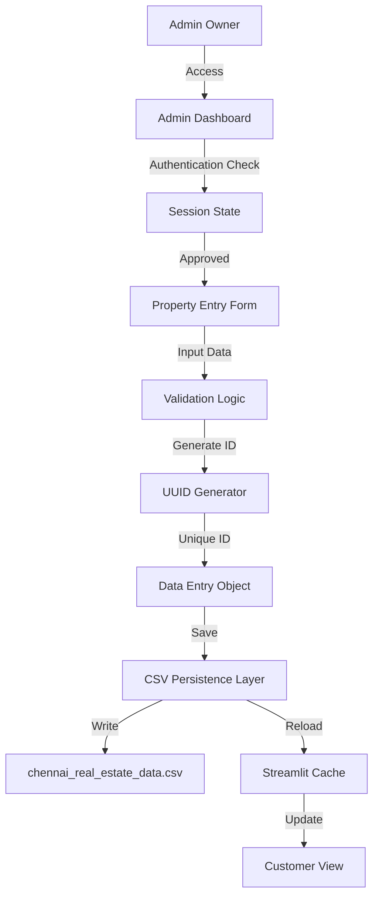

# Admin Property Management Documentation

## 1. Executive Summary

The **Admin Property Management** module allows verified owners (Admins) to add new property listings to the PropIntel platform. It features a comprehensive data entry interface, automated ID generation, and validation mechanisms to ensure data integrity. The system persists data to a local CSV file, which serves as the primary data source for the customer dashboard and ML model training.

---

## 2. Architecture Overview

### 2.1 Component Diagram



### 2.2 Key Features
- **Secure Access**: Restricted to "Admin Owner" role via `st.session_state`.
- **Comprehensive Forms**: 40+ fields covering property details, amenities, and owner info.
- **Automated ID Generation**: Unique 6-character alphanumeric IDs prefixed with "PROP-".
- **Duplicate Prevention**: Checks for identical existing records before saving.
- **Data Persistence**: Appends new records to `chennai_real_estate_data.csv`.

---

## 3. Technical Implementation

### 3.1 File Structure
- **Source File**: `pages/admin.py`
- **Data File**: `data/chennai_real_estate_data.csv`

### 3.2 Unique ID Generation
Ensures every property has a unique identifier for tracking and reference.

```python
import uuid

def generate_unique_property_id(existing_df):
    """
    Generates a unique Property ID.
    Format: PROP-Xu28d A (6 random hex chars)
    """
    while True:
        # Generate random 6-char hex string
        new_id = f"PROP-{uuid.uuid4().hex[:6].upper()}"
        
        # Ensure uniqueness
        if "Property_ID" in existing_df.columns:
            if new_id not in existing_df["Property_ID"].values:
                return new_id
        else:
            return new_id
```

### 3.3 Data Validation & Storage
Validates input and prevents duplicate entries before appending to CSV.

```python
# Create new entry dictionary
new_entry = {
    "City": city,
    "Locality": locality,
    # ... 40+ other fields
}

# Duplicate Check
existing_records = df.drop(columns=["Property_ID"], errors="ignore")
if any(existing_records.apply(lambda row: row.to_dict() == new_entry, axis=1)):
    st.error("Property already exists in the database!")
else:
    # Generate ID and Save
    property_id = generate_unique_property_id(df)
    new_entry["Property_ID"] = property_id
    
    # Append to DataFrame
    df = pd.concat([df, pd.DataFrame([new_entry])], ignore_index=True)
    
    # Save to CSV
    df.to_csv(DATA_FILE_PATH, index=False)
```

### 3.4 Data Entry Interface
Organized into collapsible sections (Expanders) for better usability.

```python
with st.expander("Basic Property Details", expanded=True):
    city = st.selectbox("City", ["Chennai"])
    locality = st.selectbox("Locality", [...])
    property_purpose = st.radio("Property Purpose", ["Rent", "Sale"])
    # ...

with st.expander("Amenities"):
    security = st.multiselect("Security Features", [...])
    gym = st.checkbox("Gym Available")
    # ...
```

---

## 4. Input Fields Hierarchy

| Section | Key Fields |
|---------|------------|
| **Basic Details** | City, Locality, Purpose, Type, BHK, SqFt |
| **Building Details** | Floor, Age, Facing, Availability, Furnishing |
| **Amenities** | Security, Gym, Pool, Parking, Water Supply |
| **Financials** | Deposit, HOA Fees, Maintenance Fee |
| **Owner Info** | Name, Email, Address, Pincode |
| **Photos** | Image Links (Comma separated) |

---

## 5. Security & Validation

1. **Role Verification**:
   ```python
   if st.session_state.get("user_role") != "Admin Owner":
       st.warning("Access Denied.")
       st.stop()
   ```

2. **Sidebar Hiding**: Hides navigation to prevent unauthorized page switching.
   ```css
   [data-testid="stSidebar"] {visibility: hidden;}
   ```

3. **Data Integrity**:
   - Numeric inputs verify reasonable ranges (e.g., BHK 1-10).
   - Dropdowns enforce standardized values (e.g., Locality lists).

---

## 6. Use Cases

### 6.1 Adding a Rental Apartment
1. **Admin**: Logs in and navigates to Admin Dashboard.
2. **Action**: Fills "Basic Details" (2 BHK, Adyar, Rent).
3. **Action**: Sets "Amenities" (Gym=Yes, Pool=No).
4. **Action**: Enters "Financials" (Rent=25k, Deposit=100k).
5. **System**: Generates ID `PROP-9A2B3C`.
6. **System**: Saves to CSV.
7. **Result**: Property is immediately searchable by customers.

### 6.2 Preventing Duplicates
1. **Admin**: Tries to submit the exact same property again.
2. **System**: Compares new entry against existing dataframe.
3. **Result**: Displays error "Property already exists!".

---

## 7. Performance Considerations

- **CSV I/O**: Efficient for < 100k records. Saving takes < 200ms.
- **Field Rendering**: Streamlit renders 40+ widgets instantly.
- **UUID Generation**: Collisions are statistically impossible for this scale.

---

## 8. Future Improvements

- **Bulk Upload**: Support CSV upload for adding multiple properties.
- **Image Upload**: Hosting images on S3 instead of just links.
- **Edit/Delete**: Functionality to modify existing listings.
- **Audit Logs**: Track which admin added which property.
