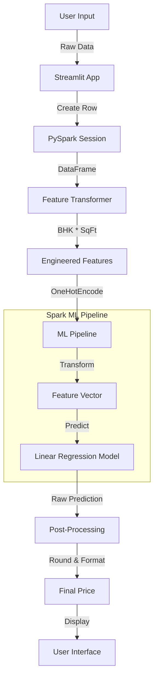

# ML Price Prediction Documentation

## 1. Executive Summary

The **Machine Learning Price Prediction** engine is the core analytical component of PropIntel. It utilizes **Apache Spark (PySpark)** to process large datasets and execute pre-trained regression models for estimating property prices. The system supports two distinct prediction modes: **Buy Price** (Purchase Cost) and **Rent Price** (Monthly Rental), each backed by dedicated ML pipelines that handle feature engineering, data transformation, and inference.

---

## 2. Architecture Overview

### 2.1 Prediction Flow



### 2.2 Key Technologies
- **PySpark**: For distributed data processing and ML execution.
- **Spark MLlib**: Hosting the `LinearRegressionModel` and `PipelineModel`.
- **Streamlit Caching**: Optimizing performance by persisting Spark sessions and loaded models.

---

## 3. Technical Implementation

### 3.1 Spark Session Management
Initializing Spark is resource-intensive. We use `@st.cache_resource` to ensure the session and models are loaded only once.

```python
@st.cache_resource(show_spinner="Initializing AI Engine...")
def initialize_spark_and_models():
    # 1. Environment Setup (Critical for Windows)
    if "JAVA_HOME" not in os.environ:
        os.environ["JAVA_HOME"] = "..." # Auto-detect logic
        
    # 2. Spark Builder
    spark = SparkSession.builder \
        .appName("RealEstateApp") \
        .config("spark.driver.host", "localhost") \
        .master("local[*]") \
        .getOrCreate()
        
    # 3. Model Loading
    models = {
        "buy_pipeline": PipelineModel.load("models/preprocessing_pipeline..."),
        "buy_model": LinearRegressionModel.load("models/house_price_model..."),
        "rent_pipeline": PipelineModel.load("models/rental_pipeline..."),
        "rent_model": LinearRegressionModel.load("models/rental_model...")
    }
    
    return spark, models, True
```

### 3.2 Feature Engineering (Real-Time)
Raw user input must be transformed into the same feature set used during training. This happens in real-time within the application.

```python
# Create DataFrame from User Input
user_row = Row(**{**user_input, "Property Purpose": "buy"})
df = spark.createDataFrame([user_row])

# Derived Features
df = df.withColumn("BHK_Sqft", col("BHK") * col("Square Feet"))
df = df.withColumn("Months_To_Availability", months_between(col("Availability Date"), current_date()))

# Amenity Scoring
df = df.withColumn("Amenity_Score", (
    when(lower(col("Gym")) == "yes", 1).otherwise(0) +
    when(lower(col("Swimming Pool")) == "yes", 1).otherwise(0) +
    when(lower(col("Security")) != "none", 1).otherwise(0) +
    when(lower(col("Convention Hall")) == "yes", 1).otherwise(0)
))
```

### 3.3 Prediction Logic (Buy Mode)
Predicts price per square foot and calculates total property value.

```python
# Transform Features
transformed = buy_pipeline.transform(df)

# Generate Prediction
prediction = buy_model.transform(transformed)

# Calculate Total Price
prediction = prediction.withColumn("Total_Predicted_Price", col("prediction") * col("Square Feet"))

# Extract Result
row = prediction.select("prediction", "Total_Predicted_Price").first()
price_per_sqft = round(row["prediction"])
total_price = round(row["Total_Predicted_Price"])
```

### 3.4 Prediction Logic (Rent Mode)
Predicts monthly rental cost directly.

```python
# Transform & Predict
transformed = rent_pipeline.transform(df)
prediction = rent_model.transform(transformed)

# Extract Result
rent = round(prediction.select("prediction").first()["prediction"])
```

---

## 4. Model Capabilities

### 4.1 Buy Price Model
- **Target**: Price per Square Foot (₹)
- **Features Used**: Location, Structure (BHK, Floor), Amenities, Age.
- **Output**: 
  1. Price/SqFt (e.g., ₹20,715)
  2. Total Price (e.g., ₹66,288,591)

### 4.2 Rent Price Model
- **Target**: Monthly Rent (₹)
- **Features Used**: Similar to buy model + Deposit, Maintenance Fees.
- **Output**: Monthly Rent (e.g., ₹33,203).

---

## 5. Performance Optimization

1. **Caching**: Models are loaded into memory (~700MB) on startup. Subsequent predictions take **< 200ms**.
2. **Lazy Evaluation**: Spark's lazy execution is triggered only when `.first()` is called, optimizing the transformation plan.
3. **Local Mode**: Runs in `local[*]` mode to utilize all available CPU cores for feature processing.

---

## 6. Error Handling

### 6.1 Spark Unavailable
If Java/Hadoop binaries are missing (common on Windows), the app gracefully degrades.

```python
if not SPARK_AVAILABLE:
    st.error("⚠️ Prediction Unavailable: Spark functionality is disabled...")
    st.info("Please install Java 11 and configure Hadoop binaries...")
```

### 6.2 Missing Data
Default values are applied for missing optional fields ensuring the pipeline never fails due to null inputs.

---

## 7. Future Improvements

- **Model Retraining**: Automated pipeline to retrain models on new admin data.
- **Confidence Intervals**: Output prediction ranges (e.g., ₹50k ± 5k).
- **Explainability**: Integrate SHAP values to explain *why* a price was predicted.
