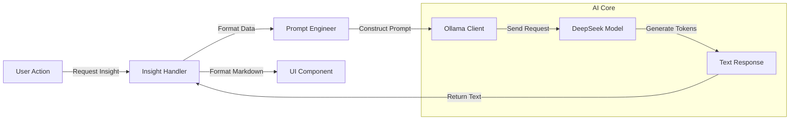

# AI Insights Engine Documentation

## 1. Executive Summary

The **AI Insights Engine** enhances the PropIntel application by providing intelligent, context-aware analysis of property data. Powered by **Ollama** running the **DeepSeek-v3.1** Large Language Model (LLM), it generates human-readable reports, negotiation advice, and market trend analysis for both customers and owners. This feature transforms raw data into actionable insights, bridging the gap between quantitative metrics and qualitative decision-making.

---

## 2. Architecture Overview

### 2.1 Integration Flow



### 2.2 Key Technologies
- **Ollama**: Local LLM runner for privacy and zero-cost inference.
- **DeepSeek-v3.1**: Advanced open-weights model capable of reasoning and summarization.
- **Python Client**: `ollama` library for synchronous API communication.

---

## 3. Technical Implementation

### 3.1 Prompt Engineering strategy
We use structured prompts to guide the LLM into specific roles (e.g., "Real Estate Expert") and enforce output formats.

#### Customer Insight Prompt (`pages/customer.py`)
Analyzes a list of filtered properties to recommend the best option.

```python
prompt = f"""
You are a real estate expert.
Analyze the following property listings and recommend the best one:
{summary_data}

Please follow this format:
Property Recommendation: [Recommendation]
Reasoning:
1. [Point 1]
...
Concerns:
1. [Concern 1]
...
Negotiation Advice:
1. [Advice 1]
...
"""
```

#### Owner Insight Prompt (`pages/owner.py`)
Provides feedback on pricing strategy and property attractiveness.

```python
prompt = f"""
A owner provided the following real estate property details:
{input_summary}

Predicted Value: {prediction_line}

Based on this information, provide a helpful real estate suggestion for increasing value.
Appreciate the owner's choice and give them profit estimates.
"""
```

### 3.2 Ollama Integration
Simple, synchronous API call handling with error management.

```python
import ollama

def get_ollama_insight(prompt):
    try:
        response = ollama.chat(
            model='deepseek-v3.1:671b-cloud',
            messages=[{'role': 'user', 'content': prompt}]
        )
        return response['message']['content'].strip()
    except Exception as e:
        return f"Ollama Error: {e}"
```

---

## 4. Use Cases

### 4.1 For Customers: "Smart Assistant"
- **Scenario**: A user filters 5 properties in "Adyar".
- **AI Action**: Scans the dataframe summary.
- **Insight**: "Property B is the best deal. Although it's slightly older (15 years), it has a larger lot size and simpler amenities, suggesting lower maintenance costs. Ask for a 5% discount citing the age."

### 4.2 For Owners: "Market Consultant"
- **Scenario**: An owner enters details for a 3BHK with pool.
- **Model Predicts**: ₹1.5 Cr.
- **AI Action**: "Great choice! The pool adds significant premium in this locality. To maximize value, ensure the pool maintenance records are available, as this is a common buyer concern. You could potentially list for ₹1.6 Cr given the current demand."

---

## 5. Performance & Limitations

| Aspect | Performance | Notes |
|--------|-------------|-------|
| **Latency** | 2-10 seconds | Depends on GPU/CPU of the host machine. |
| **Context Window** | ~4k tokens | Sufficient for analyzing ~20 property summaries. |
| **Accuracy** | High (Reasoning) | Dependent on the underlying model quality (DeepSeek). |
| **Privacy** | 100% Local | No data leaves the user's infrastructure. |

---

## 6. Configuration

- **Model Selection**: Currently hardcoded to `deepseek-v3.1:671b-cloud`. Can be switched to `llama3` or `mistral` by changing the `model` parameter.
- **Host**: Defaults to `localhost:11434`. Configurable via `OLLAMA_HOST` env var in Docker.

### 6.1 Docker Configuration
Ensures the container can access the host's Ollama instance.

```yaml
# docker-compose.yml
environment:
  - OLLAMA_HOST=http://host.docker.internal:11434
extra_hosts:
  - "host.docker.internal:host-gateway"
```

---

## 7. Future Improvements

- **Streaming Responses**: Show text as it generates for better UX.
- **Structured Output**: Force JSON output for easier parsing and UI rendering.
- **RAG Integration**: Retrieval-Augmented Generation using a vector database of market reports.
