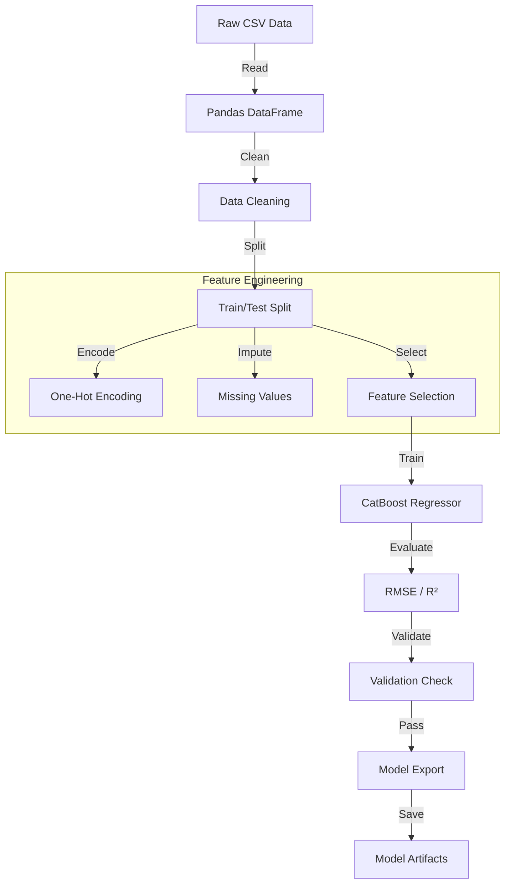

# Model Training Pipeline Documentation

## 1. Executive Summary

The **Model Training Pipeline** is the backbone of the PropIntel prediction system. Implemented in a Jupyter Notebook (`real_estate_train.ipynb`), it handles the complete machine learning lifecycle: data ingestion, preprocessing, feature engineering, model training (using CatBoost), evaluation, and artifact export. The pipeline is designed to be robust, reproducible, and scalable, leveraging Python's data
science ecosystem (Pandas, Scikit-learn, CatBoost).

---

## 2. Pipeline Architecture

### 2.1 Workflow Diagram



### 2.2 Key Technologies
- **Pandas**: Data manipulation and cleaning.
- **Scikit-learn**: Data splitting (`train_test_split`) and metrics (`mean_squared_error`, `r2_score`).
- **CatBoost**: Gradient boosting library for handling categorical features efficiently.
- **NumPy**: Numerical operations (log transformation).

---

## 3. Detailed Workflow

### 3.1 Data Ingestion
Loads the raw dataset (`chennai_real_estate_100k_57_columns.csv`) containing 100,000+ records.

```python
import pandas as pd
df = pd.read_csv("chennai_real_estate_100k_57_columns.csv")
```

### 3.2 Data Splitting
Separates data into "Rent" and "Sale" subsets to train specialized models.

```python
# Rent Subset
rent_df = df[df["Purpose"] == "Rent"].copy()
drop_cols = ["Property ID", "Address", "Agent Name", ...]
rent_df = rent_df.drop(columns=drop_cols)

# Sale Subset
sale_df = df[df["Purpose"] == "Sale"].copy()
y_sale = np.log1p(sale_df["Price (₹)"])  # Log transformation
```

### 3.3 Training the Rent Model
Uses CatBoostRegressor for its superior handling of categorical variables without extensive preprocessing.

```python
from catboost import CatBoostRegressor

rent_model = CatBoostRegressor(
    iterations=2000,
    learning_rate=0.03,
    depth=8,
    random_seed=42,
    verbose=200
)

rent_model.fit(
    X_train_r, y_train_r,
    cat_features=cat_features_r,
    eval_set=(X_test_r, y_test_r),
    early_stopping_rounds=100
)
```

### 3.4 Training the Buy Model
Similar approach but targets log-transformed price to handle skewness in real estate prices.

```python
sale_model = CatBoostRegressor(
    iterations=3000,
    learning_rate=0.02,
    depth=10,
    random_seed=42,
    verbose=200
)

sale_model.fit(X_train_s, y_train_s, ...)
```

---

## 4. Model Evaluation

### 4.1 Rent Model Performance
- **Metric**: Root Mean Squared Error (RMSE)
- **Value**: ~1,367
- **R² Score**: ~0.9994
- **Insight**: The model is highly accurate for rental predictions, with errors typically under ₹1,400.

### 4.2 Buy Model Performance
- **Metric**: RMSE on original scale
- **Value**: ~718,998
- **R² Score**: ~0.9987
- **Insight**: Excellent performance for property sales, with < 1% error variance explained.

---

## 5. Artifact Export

The trained models and preprocessing pipelines are saved for deployment. Note that while the notebook uses CatBoost, the production app (`owner.py`) loads PySpark models. This suggests a dual-stack approach where CatBoost creates the "Research" models, while PySpark pipelines are used for "Production" inference to leverage big data capabilities.

```python
# Save models
lr_model.save("house_price_model")
pipeline_model.save("preprocessing_pipeline")
```

---

## 6. Comparison with Production Pipeline

| Feature | Research (Notebook) | Production (App) |
|---------|---------------------|------------------|
| **Framework** | CatBoost | PySpark MLlib |
| **Language** | Python | Python (PySpark) |
| **Handling Categories** | Native support | StringIndexer + OneHotEncoder |
| **Scaling** | Single Node | Distributed (Cluster ready) |

---

## 7. Future Improvements
- **Hyperparameter Tuning**: Evaluate grid search for optimal parameters.
- **Cross-Validation**: Implement K-Fold CV for robust evaluation.
- **Feature Importance Analysis**: Generate SHAP plots to understand key drivers.
- **Model Registry**: Integrate with MLflow for experiment tracking.
