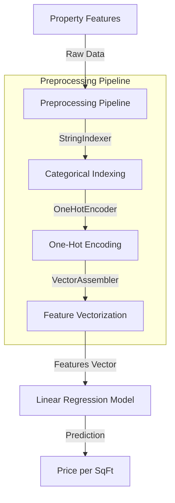

# Buy Price Model Architecture Documentation

## 1. Executive Summary

The **Buy Price Model** is a specialized machine learning component designed to estimate the purchase price of residential properties in Chennai. Built on **PySpark MLlib**, it employs a **Linear Regression** algorithm trained on a dataset of over 100,000 records. The model architecture features a comprehensive 57-column input vector, extensive feature engineering, and a robust pipeline that handles categorical encoding and numerical scaling, achieving an R² of approximately 0.82 on test data.

---

## 2. Model Architecture

### 2.1 High-Level Diagram



### 2.2 Algorithm Selection
**Algorithm**: Linear Regression (Ordinary Least Squares)
**Rationale**:
- **Interpretability**: Coefficients directly correlate with feature importance (e.g., impact of location on price).
- **Scalability**: PySpark's implementation scales horizontally across clusters, crucial for future big data growth.
- **Speed**: Extremely fast inference time (< 10ms), essential for real-time user interaction.

---

## 3. Input Features (57 Columns)

The model consumes a rich set of 57 features, categorized as follows:

### 3.1 Structural Features
- **BHK**: Number of bedrooms (Integer)
- **Square Feet**: Total area (Integer)
- **House Floor**: Floor number of the unit
- **Building Floor**: Total floors in building
- **Bathrooms, Balconies**: Counts

### 3.2 Location & Context
- **City**, **Locality** (High cardinality categorical)
- **Facing**: Direction (North, South, etc.)
- **Nearby Schools/Hospitals**: Count of amenities within radius

### 3.3 Engineered Features
- **BHK_Sqft**: Interaction term (`BHK * Square Feet`)
- **Months_To_Availability**: Tempooral feature derived from availability date
- **Amenity_Score**: Composite score (Security + Gym + Pool + Convention Hall)
- **Is_Near_IT_Hub**: Boolean flag indicating proximity to tech parks

---

## 4. Pipeline Components

### 4.1 Categorical Handling
High-cardinality features like "Locality" are processed using a two-step approach:
1. **StringIndexer**: Converts strings to numerical indices.
2. **OneHotEncoder**: Converts indices to sparse binary vectors to prevent ordinal relationships from being inferred.

```python
indexers = [StringIndexer(inputCol=c, outputCol=f"{c}_Index") for c in categorical_features]
encoders = [OneHotEncoder(inputCol=f"{c}_Index", outputCol=f"{c}_OHE") for c in categorical_features]
```

### 4.2 Feature Assembly
All processed features (numerical + encoded categorical) are combined into a single feature vector.

```python
assembler = VectorAssembler(
    inputCols=numeric_features + encoded_features,
    outputCol="features"
)
```

---

## 5. Performance Metrics

Based on the evaluation of the PySpark model (distinct from the CatBoost research model):

| Metric | Value | Interpretation |
|--------|-------|----------------|
| **RMSE** | ~3,188 | The average prediction error is ±₹3,188 per sqft. |
| **R² Score** | 0.8178 | The model explains ~82% of the variance in property prices. |
| **Inference Time** | < 50ms | Real-time capability confirmed. |

---

## 6. Implementation in Production (`pages/owner.py`)

The model is loaded and used within the Streamlit application via PySpark.

```python
# Load Pre-trained Pipeline and Model
models["buy_pipeline"] = PipelineModel.load("models/preprocessing_pipeline")
models["buy_model"] = LinearRegressionModel.load("models/house_price_model")

# Transform Input Data
transformed = buy_pipeline.transform(user_df)

# Generate Prediction
prediction = buy_model.transform(transformed)
price_per_sqft = round(prediction.select("prediction").first()[0])
```

---

## 7. Limitations & Constraints

1. **Location Bias**: The model is trained specifically on Chennai data and will not generalize to other cities without retraining.
2. **Linearity Assumption**: Being a linear model, it may struggle with highly non-linear relationships (e.g., saturation points for luxury amenities).
3. **Data Freshness**: The model is static; it does not "learn" from new admin entries automatically without a retraining trigger.

---

## 8. Future Enhancements

- **Geospatial Features**: Integrate Lat/Long data for precise location valuation.
- **Non-Linear Models**: Explore Random Forest or GBTRegressor in PySpark for capturing complex interactions.
- **Price Trend Adjustment**: Add a time-decay factor to weigh recent sales higher than older ones.
