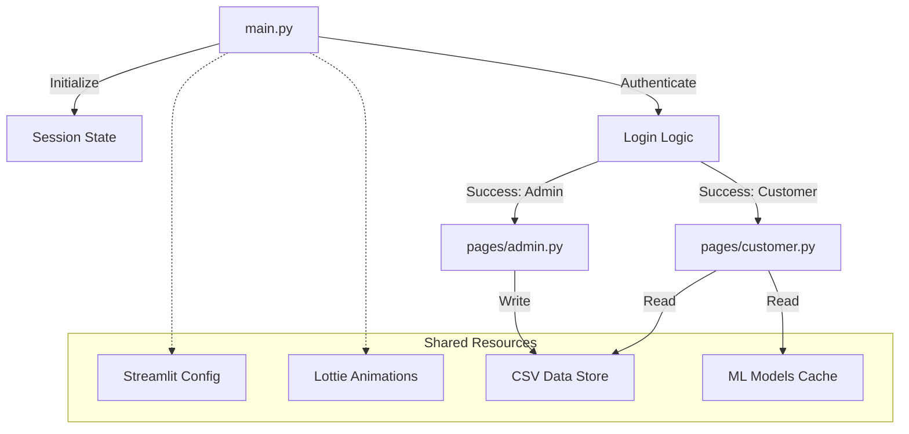

# Application Architecture Documentation

## 1. Executive Summary

PropIntel is architected as a **Multi-Page Single-Page Application (SPA)** using **Streamlit**. It follows a modular design pattern where the main entry point (`main.py`) handles authentication and routing, while specific functionalities are encapsulated in separate page modules (`pages/`). This architecture ensures separation of concerns, maintainability, and a seamless user experience with state persistence across navigations.

---

## 2. High-Level Component Diagram



---

## 3. Directory Structure and Modules

### 3.1 Core Files

- **`main.py`**: The application kernel.
  - **Responsibilities**: Session initialization, Page configuration, Login/Signup UI, Authentication logic.
  - **Key State**: `logged_in`, `user_role`, `user_name`.

- **`pages/customer.py`**: The search and discovery interface.
  - **Responsibilities**: Filter UI, Property Scoring, AI Insights display.
  - **Key State**: Filters dictionary, Cached dataframes.

- **`pages/admin.py`**: The owner management portal.
  - **Responsibilities**: Data Entry forms, Validation, Persistence.
  - **Key State**: Form inputs, Submission status.

- **`pages/owner.py`**: The prediction interface for owners.
  - **Responsibilities**: Buy/Rent Price Prediction form, Spark Model inference.
  - **Key State**: Prediction inputs, Spark session.

### 3.2 Data Layer
Located in `/data` and root directory.
- `chennai_real_estate_data.csv`: The master property database.
- `customer_data.csv` / `admin_owner_data.csv`: User credentials.

### 3.3 Model Layer
Located in `/models`.
- Contains serialized PySpark pipelines and trained models.

---

## 4. State Management

Streamlit's `st.session_state` is the backbone of the application's reactivity and persistence.

### 4.1 Session Lifecycle
1. **Initialization**: On first load, `main.py` sets default state values.
2. **Updates**: User interactions (Button clicks, Form submits) update state variables.
3. **Persistance**: State is preserved across re-runs (Streamlit's execution model).
4. **Clearing**: Explicitly cleared on "Logout".

```python
# Initialization Pattern
if "logged_in" not in st.session_state:
    st.session_state.update({
        "logged_in": False,
        "user_role": None,
        "page": "Login"
    })

# Logout Pattern
if st.button("Logout"):
    st.session_state.clear()
    st.switch_page("main.py")
```

---

## 5. Navigation & Routing

The application uses **Streamlit's Multipage App** feature combined with programmatic navigation.

### 5.1 RBAC Routing
Role-Based Access Control is enforced by checking session state at the top of every page. If unauthorized, the user is redirected.

```python
# In pages/customer.py
if st.session_state.get("user_role") != "Customer":
    st.warning("Access Denied")
    st.switch_page("main.py")
```

### 5.2 Explicit Switching
`st.switch_page()` allows for programmatic transitions based on logic (e.g., successful login).

```python
# In main.py
if login_success:
    if role == "Customer":
        st.switch_page("pages/customer.py")
```

---

## 6. UI/UX Architecture

### 6.1 Layout System
- **Wide Mode**: `layout="wide"` set universally for better data visualization.
- **Columns**: Used extensively to create responsive, grid-like layouts (e.g., 2-column forms).
- **Expanders**: Used to group related but secondary information (e.g., "Amenities" in Admin form).

### 6.2 Visual Components
- **Lottie Animations**: JSON-based vector animations for engaging loading states and landing pages.
- **Custom CSS**: Injected via `st.markdown` to hide default Streamlit elements (like the sidebar on login) and style headers.

---

## 7. Performance Considerations

### 7.1 Caching Strategy
- **`@st.cache_data`**: Used for CSV loading. Invalidated only when file changes.
- **`@st.cache_resource`**: Used for Spark Session and Model loading. Loaded once per server process.

### 7.2 Async Operations
- **Ollama**: Calls are synchronous currently. While fast enough for local LLMs, this blocks the main thread. 
- **Future Optimization**: Use `asyncio` or threading to prevent UI freeze during AI generation.

---

## 8. Security Architecture

- **Input Sanitization**: Basic validation in forms.
- **State Security**: Session state is server-side (in memory), ensuring client cannot tamper with `logged_in` status easily.
- **File Access**: Restricted to specific directories (`data/`, `models/`).
