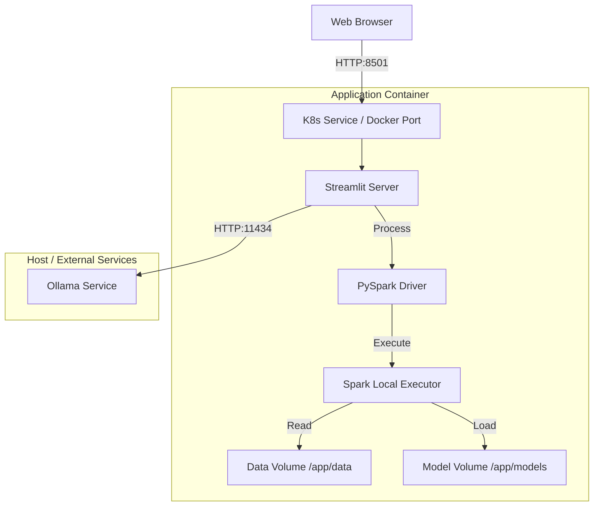

# System Architecture Documentation

## 1. Executive Summary

The **System Architecture** of PropIntel is designed for flexibility and scalability, supporting deployment environments ranging from local development machines to containerized clusters. The system leverages **Docker** for consistent runtime environments and **Kubernetes** for orchestration, ensuring that the heavy Python/Java dependencies (Spark, Hadoop) crucial for the ML pipeline are managed efficiently and deployed reliably.

---

## 2. Deployment Topology

### 2.1 Containerized Architecture (Docker/K8s)



### 2.2 Components

#### 1. Web Tier (Streamlit)
- **Role**: Serves the UI and handles user sessions.
- **Port**: 8501
- **Scalability**: Stateless (session affinity required if scaled horizontally without external session store).

#### 2. Compute Tier (PySpark)
- **Role**: Processes ML inference requests.
- **Configuration**: Runs in `local[*]` mode within the container, utilizing all assigned CPU cores.
- **Dependencies**: Requires OpenJDK 17 and Hadoop binaries (included in Docker image).

#### 3. AI Tier (Ollama)
- **Role**: Provides LLM inference for insights.
- **Deployment**: Typically runs on the host machine (GPU accelerated) or a separate service, accessed via `host.docker.internal`.

---

## 3. Infrastructure Requirements

### 3.1 Minimum Hardware
- **CPU**: 2 vCPUs (Allocated to Docker/Pod)
- **RAM**: 4GB (Spark Heap + Python Overhead)
- **Storage**: 2GB (Models: ~800MB, Data: ~100MB, Image: ~1GB)

### 3.2 Operating System
- **Development**: Windows 10/11 (with WSL2), macOS, Linux.
- **Production**: Linux (Debian Bookworm base image).

---

## 4. Network Architecture

### 4.1 Internal Communication
- **Streamlit <-> PySpark**: In-process communication (JVM via Py4J). Extremely low latency.
- **Spark <-> File System**: Direct file I/O for reading CSVs and Parquet models.

### 4.2 External Communication
- **Browser <-> App**: HTTP/1.1 over TCP port 8501. WebSocket for Streamlit reactivity.
- **App <-> Ollama**: HTTP POST requests to `http://host.docker.internal:11434/api/chat`.

---

## 5. Scalability & Reliability

### 5.1 Horizontal Scaling (K8s)
- **ReplicaSet**: Configured to run 1 replica by default in `k8s-deployment.yaml`.
- **Scaling Strategy**: Can be scaled to `N` replicas.
- **Load Balancing**: K8s Service (NodePort) distributes traffic. *Note: Session stickiness is required due to Streamlit's in-memory session state.*

### 5.2 Fault Tolerance
- **Liveness Probe**: Checks `/_stcore/health` every 10s. Restarts container if Streamlit hangs.
- **Readiness Probe**: Ensures app is fully loaded before accepting traffic.

```yaml
livenessProbe:
  httpGet:
    path: /_stcore/health
    port: 8501
  initialDelaySeconds: 30
```

---

## 6. Environment Configuration

Managed via Environment Variables in Docker/K8s:

| Variable | Description | Default |
|----------|-------------|---------|
| `JAVA_HOME` | Path to Java JDK | `/usr/lib/jvm/default-java` |
| `PYSPARK_PYTHON` | Python interpreter | `python3` |
| `OLLAMA_HOST` | URL for AI service | `http://host.docker.internal...` |

---

## 7. Security Architecture

### 7.1 Container Security
- **Base Image**: `python:3.11-slim-bookworm` (Official, minimized attack surface).
- **User**: Runs as root (default). *Recommendation: Create non-root user `appuser`.*

### 7.2 Network Policies
- **Exposure**: Only port 8501 is exposed.
- **Internal Traffic**: No sensitive data transmitted externally (except to local Ollama).

---

## 8. Data Persistence

### 8.1 Volumes
- **Data Volume**: `/app/data` is mounted to persist admin uploads (`chennai_real_estate_data.csv`).
- **Criticality**: If the container is destroyed without a volume, new property entries are lost.

### 8.2 Backup Strategy
- **Manual**: Periodically copy `chennai_real_estate_data.csv` from the volume.
- **Future**: Automate backup to S3 bucket.
