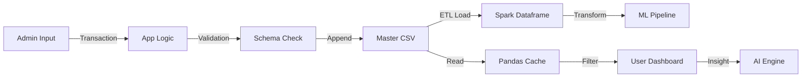

# Data Architecture Documentation

## 1. Executive Summary

PropIntel's **Data Architecture** is centered around a robust, flat-file schema optimized for both transactional operations (Admin entry) and analytical processing (Spark ML). The core dataset consists of a 57-column CSV file (`chennai_real_estate_data.csv`) that captures granular details of residential properties. This architecture favors simplicity and portability, leveraging Apache Spark's distributed processing capabilities to handle volume scaling without the complexity of a relational database management system (RDBMS).

---

## 2. Data Flow Diagram

---

## 3. Schema Definition (57 Columns)

The dataset is denormalized to facilitate efficient columnar processing.

### 3.1 Primary Identifiers
- **Property_ID**: Unique alphanumeric key (e.g., `PROP-A1B2C3`).
- **Owner_Name**, **Owner_Email**, **Owner_Phone**: Contact details (PII).

### 3.2 Location Hierarchy
- **City**: Top-level administrative division (e.g., "Chennai").
- **Locality**: Sub-regions (e.g., "Adyar", "OMR"). High cardinality categorical variable.
- **Address**, **Pincode**, **State**: Detailed geolocation.

### 3.3 Physical Characteristics
- **BHK**: Bedrooms (1-10)
- **Bathrooms**: (1-5)
- **Balcony**: (0-3)
- **Square Feet**: Built-up area
- **House Floor** / **Building Floor**: Vertical location
- **Facing**: Cardinal direction
- **Furnishing**: Status

### 3.4 Amenities (Boolean/Categorical)
- **Security**: Type (CCTV, Guards)
- **Gym**, **Pool**, **Convention Hall**: Binary (Yes/No)
- **Parking**: Type (Car, Bike, Both, None)
- **Water Supply**: Source (Corporation, Borewell)
- **Lift Facility**, **Power Backup**: Infrastructure

### 3.5 Financials
- **Price**: Sale price or Monthly rent.
- **Deposit**: Security deposit (Rental only using `Deposit Cost`).
- **HOA Fees**: Monthly maintenance.
- **Stamp Duty**, **Registration Fee**: Transaction costs.

### 3.6 Temporal & Status
- **Availability Date**: YYYY-MM-DD
- **Possession Status**: Ready to Move / Under Construction
- **Property Age**: Years since construction

---

## 4. Data Storage Strategy

### 4.1 Persistence Layer
- **Format**: CSV (Comma Separated Values)
- **Reasoning**:
  - **Human Readable**: Easy for admins to debug/audit.
  - **Spark Native**: Highly optimized readers in Spark/Pandas.
  - **Zero Ops**: No database server maintenance.

### 4.2 Caching Strategy
- **Pandas**: Used for dashboard filtering. Loaded via `@st.cache_data`.
- **Spark**: Used for ML training/inference. DataFrames are cached in memory (`.cache()`) during pipeline execution.

---

## 5. Data Quality & Validation

### 5.1 Input Constraints
Enforced at the application level (`pages/admin.py`):
- **Uniqueness**: `Property_ID` must be unique.
- **Referential Integrity**: Derived from `City` -> `Locality` dropdowns.
- **Type Safety**: Numeric fields (Price, SqFt) strictly enforced by `st.number_input`.

### 5.2 Normalization
- **Text**: Converted to lowercase, whitespace trimmed.
- **Missing Values**:
  - Numeric: Imputed with 0 or Median.
  - Categorical: Imputed with "Unknown".

---

## 6. Scalability Considerations

| Metric | Current Limits | Future Strategy |
|--------|----------------|-----------------|
| **Volume** | ~1GB CSV / 500k rows | Move to Parquet format on S3 |
| **Throughput** | Sequential writes | Append-only log / Message Queue (Kafka) |
| **Concurrent Reads** | OS File Lock limits | SQLite or PostgreSQL migration |

---

## 7. Security & Compliance

### 7.1 PII Protection
- **Owner Data**: Stored in plain text currently. *Recommendation: Encrypt sensitive columns or move to a secured separate table.*
- **Access Control**: Only "Admin" role can write. "Customer" role has read-only access to non-PII fields (Owner contact hidden until inquiry).

### 7.2 Backup
- **Volume Backups**: K8s PersistentVolume snapshots recommended.
- **Version Control**: Not applicable to data file (too large for Git).
