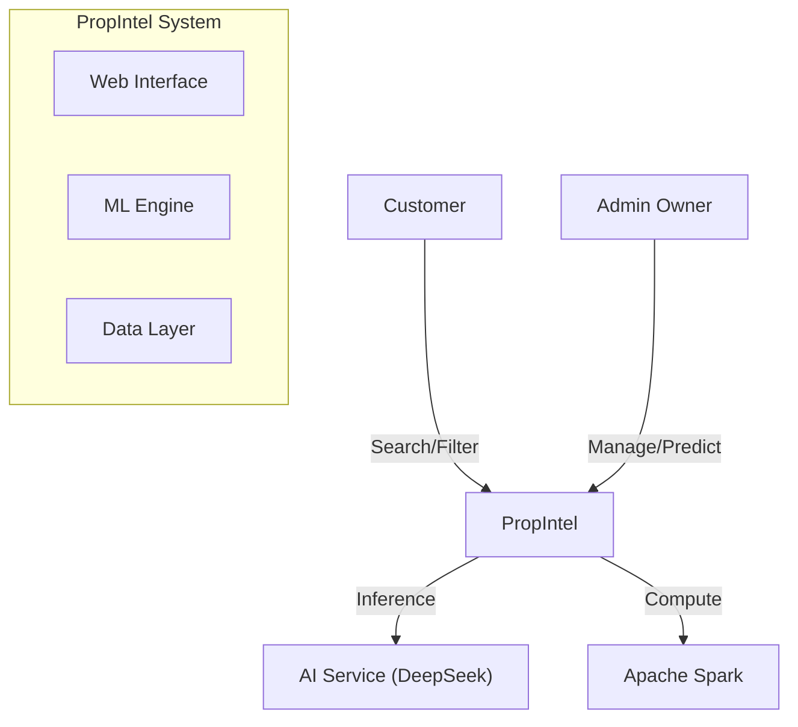

# High-Level Design (HLD) Documentation

## 1. Introduction

### 1.1 Purpose
The High-Level Design (HLD) provides a strategic overview of the **PropIntel** real estate prediction platform. It outlines the system's architecture, key components, data flow, and technology choices, serving as a roadmap for understanding how the application delivers value to its users (Customers and Owners).

### 1.2 Scope
This document covers:
- System Architecture Diagram
- Functional Modules
- Technology Stack
- External Interfaces
- Security & Deployment Strategy

---

## 2. System Architecture

PropIntel follows a **Microservices-inspired Monolith** architecture where distinct functionalities (Auth, Search, Prediction) are modularized within a single deployable unit (Streamlit App) but can be independently scaled or extracted in future iterations.

### 2.1 Context Diagram

---

## 3. Key Functional Modules

### 3.1 Authentication Module
- **Responsibility**: Validate user identity and assign roles.
- **Components**: `main.py` (Login UI), `auth_logic` (Hashing).
- **Data**: `customer_data.csv`, `admin_owner_data.csv`.

### 3.2 Property Management Module (Admin)
- **Responsibility**: CRUD operations for property listings.
- **Components**: `pages/admin.py` (Forms), `validation_logic` (Dedup).
- **Data**: `chennai_real_estate_data.csv`.

### 3.3 Discovery Module (Customer)
- **Responsibility**: Search, filter, and rank properties.
- **Components**: `pages/customer.py` (Dashboard), `scoring_algo` (Weighted Rank).
- **Integration**: AI Recommendations via Ollama.

### 3.4 Pediction Module (Owner/ML)
- **Responsibility**: Estimate property value (Buy/Rent).
- **Components**: `pages/owner.py`, `Spark Pipeline`.
- **Data**: Serialized Models (`models/`).

---

## 4. Technology Stack

| Layer | Technology | Justification |
|-------|------------|---------------|
| **Frontend** | Streamlit | Rapid prototyping, Python-native, built-in interactivity. |
| **Backend Logic** | Python 3.11 | Rich ecosystem for data science and web development. |
| **ML Engine** | PySpark 3.5 | Distributed processing capability for large datasets. |
| **AI Integration** | Ollama | Local, privacy-focused LLM inference. |
| **Data Storage** | CSV (Local) | Simplicity, portability, and Spark compatibility. |
| **Containerization** | Docker | Consistent runtime, dependency management (Java/Python). |
| **Orchestration** | Kubernetes | Scalability and production readiness. |

---

## 5. Data Flow

### 5.1 User Request Flow
1. **User** accesses application URL (HTTP:8501).
2. **Streamlit** creates a session and renders the UI.
3. **User** submits input (e.g., "Predict Price").
4. **App** validates input and calls **Spark Engine**.
5. **Spark** processes data using pre-loaded **ML Pipelines**.
6. **Result** is formatted and displayed to User.
7. **Optional**: AI Insight is requested from **Ollama** and displayed.

### 5.2 Data Ingestion Flow
1. **Admin** submits new property details.
2. **App** validates data (Types, Uniqueness).
3. **App** generates UUID.
4. **App** appends record to **Master CSV**.
5. **Next Step**: Training pipeline (offline) picks up new data for model retraining.

---

## 6. Security Design

### 6.1 Authentication
- **Mechanism**: RBAC (Role-Based Access Control).
- **Storage**: Hashed passwords (SHA-256).

### 6.2 Application Security
- **Input Validation**: Strict typing on all form inputs.
- **Session Isolation**: Streamlit session state ensures user data doesn't leak between sessions.
- **Network**: Only port 8501 exposed; AI service internal-only.

---

## 7. Deployment Strategy

### 7.1 Docker
- Single-container deployment for development/testing.
- `docker-compose` orchestrates App + (Optional) External Services.

### 7.2 Kubernetes
- **Deployment**: `ReplicaSet` for availability.
- **Service**: `NodePort` or `LoadBalancer` for external access.
- **Volumes**: `PersistentVolumeClaim` (PVC) for data persistence.

---

## 8. Interface Design

### 8.1 User Interfaces
- **Login**: Clean, centered card layout.
- **Dashboards**: Sidebar navigation (hidden/shown based on context), KPI cards, Interactive DataFrames.

### 8.2 API Interfaces (Internal)
- **Spark**: `spark.createDataFrame()`, `model.transform()`.
- **Ollama**: REST API (`POST /api/chat`).
