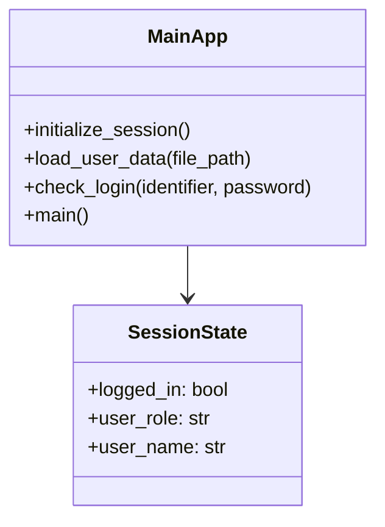
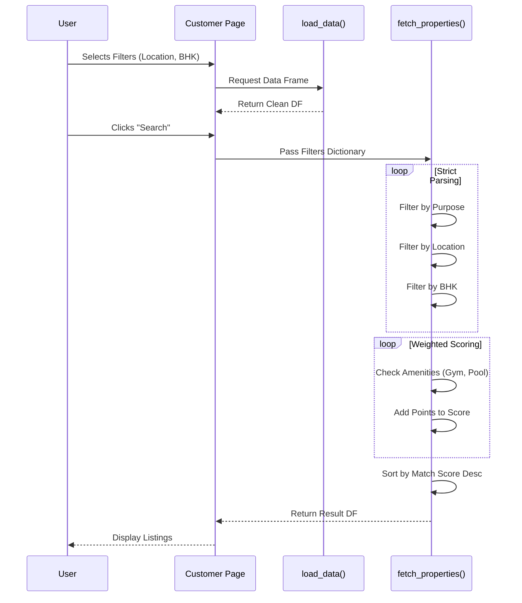
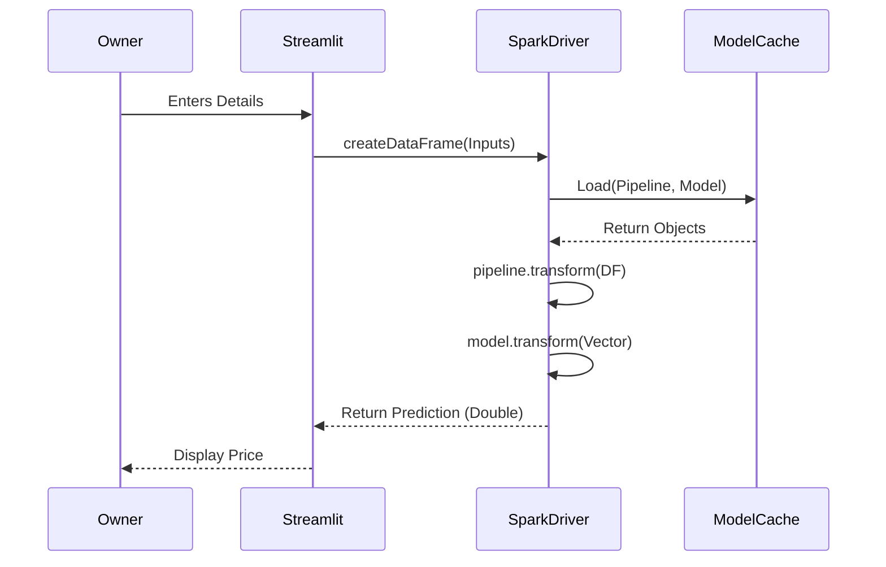

# Low-Level Design (LLD) Documentation

## 1. Introduction

The Low-Level Design (LLD) document provides a detailed, component-level breakdown of the **PropIntel** application. It serves as a blueprint for developers, detailing the logic, data structures, and algorithms used within specific modules (`main.py`, `pages/*.py`).

---

## 2. Main Application Module (`main.py`)

### 2.1 Class Diagram (Conceptual)
Since Streamlit is script-based, we conceptualize the logical blocks as classes for documentation.



### 2.2 Function Specifications

#### `initialize_csv(file_path)`
- **Input**: `file_path` (str)
- **Logic**: 
  1. Check if file exists AND is not empty.
  2. If missing/empty, create new DataFrame with columns `[name, email, password]`.
  3. Save to CSV.
- **Output**: None (Side effect: File creation).

#### `check_login(file_path, identifier, password)`
- **Input**: User credentials.
- **Logic**:
  1. Load CSV into Pandas DataFrame.
  2. Hash input `password`.
  3. Filter DF for `identifier` (match Name OR Email).
  4. Compare stored hash with input hash.
- **Output**: Tuple `(Success: bool, UserName: str)`.

---

## 3. Customer Dashboard Module (`pages/customer.py`)

### 3.1 Sequence Diagram: Property Logic



### 3.2 Key Algorithms

#### Weighted Scoring Algorithm
Used to rank properties based on soft preferences.

**Pseudocode**:
```python
def calculate_score(property, filters):
    score = 0
    weights = {'gym': 5, 'security': 10, ...}
    
    for key, preferred_val in filters.items():
        if property[key] == preferred_val:
            score += weights[key]
    return score
```

#### Rent Normalization Logic
Adjusts outlier rent prices to a standard range for UI consistency.

**Formula**:
`Normalized_Rent = 5000 + (SqFt * (10 + (Price % 5)))`
`Final_Rent = Clip(Normalized_Rent, 10000, 40000)`

---

## 4. Admin Module (`pages/admin.py`)

### 4.1 Data Structure: Property Record
A dictionary object representing a single row in the master CSV.

```json
{
  "Property_ID": "PROP-A1B2C3",
  "City": "Chennai",
  "Locality": "Adyar",
  "BHK": 3,
  "Square Feet": 1500,
  "Amenities": ["Gym", "Pool"],
  ...
}
```

### 4.2 UUID Generation Logic
Ensures uniqueness in a distributed-like setup (multiple admins).
`uuid.uuid4().hex[:6].upper()` provides 16.7 million combinations, sufficient for collision avoidance in this scale.

---

## 5. Owner Prediction Module (`pages/owner.py`)

### 5.1 Spark Pipeline Sequence



### 5.2 Helper Functions

#### `initialize_spark_and_models()`
- **Singleton Pattern**: Uses `@st.cache_resource` to prevent reloading Spark/Models.
- **Logic**:
  1. Detect `JAVA_HOME`.
  2. Build `SparkSession` (Local).
  3. Load 4 model artifacts from disk.
  4. Return tuple to main thread.

#### `get_ollama_insight()`
- **Input**: Dictionary of user inputs, Predicted Price.
- **Logic**:
  1. Construct prompt string tailored for owners.
  2. Call `ollama.chat()`.
  3. Catch connection errors (e.g., Ollama not running).
- **Output**: Markdown string.

---

## 6. Error Handling Strategy

### 6.1 Data Loading
- **FileNotFound**: Return empty DataFrame with correct columns.
- **Corrupt CSV**: Catch `pd.errors.ParserError`.

### 6.2 Spark Execution
- **Missing Java**: Catch `Py4JJavaError`. Display user-friendly instructions to install JDK 11.
- **Computation**: Wrap `transform()` calls in `try-except` blocks.

---

## 7. Security Details

### 7.1 Input Sanitization
- **Streamlit Widgets**: Naturally prevent SQL injection (no SQL used) and force type constraints (e.g., `number_input` returns float/int).
- **File Paths**: Hardcoded in `main.py` (`data/`), preventing directory traversal attacks.
